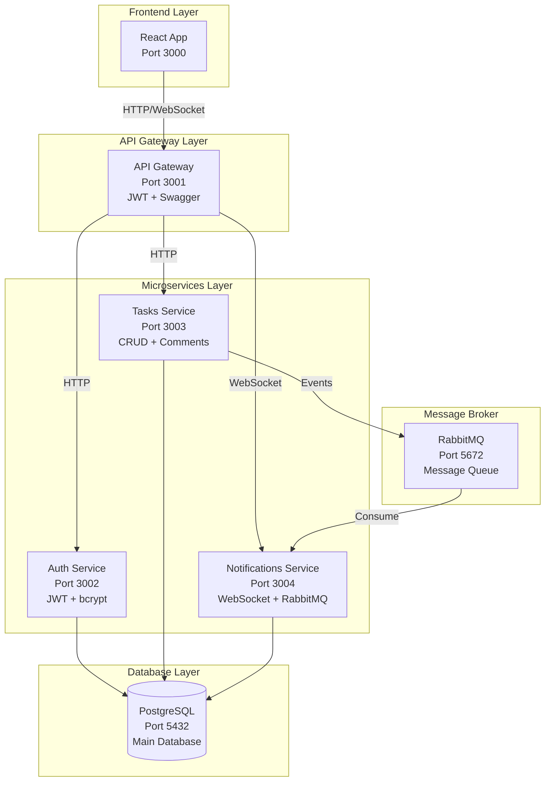

# 🎯 Sistema de Gestão de Tarefas Colaborativo - [Jungle Gaming](https://www.junglegaming.io/)

[](https://nestjs.com/)
[](https://reactjs.org/)
[](https://www.typescriptlang.org/)
[](https://www.docker.com/)
[](https://www.postgresql.org/)

> **📋 Teste Técnico Completo** - Sistema de gestão de tarefas colaborativo desenvolvido como teste prático para a vaga de **Full-stack Developer Júnior** na **Jungle Gaming**.

## 📖 Sobre o Projeto

Este projeto implementa um sistema completo de gestão de tarefas colaborativo seguindo uma arquitetura de microserviços moderna. O sistema permite que equipes gerenciem tarefas, atribuam responsáveis, comentem e recebam notificações em tempo real.

### 🎯 Objetivos Alcançados

- ✅ **Arquitetura de Microserviços** com NestJS
- ✅ **Frontend Moderno** com React + TanStack Router
- ✅ **Autenticação JWT** com refresh tokens
- ✅ **Notificações em Tempo Real** via WebSocket
- ✅ **Comunicação Assíncrona** com RabbitMQ
- ✅ **Containerização Completa** com Docker
- ✅ **Documentação Swagger** da API

> **📚 Para mais detalhes sobre os requisitos do teste, consulte o [TEST_README.md](./TEST_README.md)**

## 🏗️ Arquitetura

O sistema foi construído seguindo uma arquitetura de microserviços moderna com as seguintes características:

### 🎨 Diagrama de Arquitetura



### 🔧 Características Principais

- **🏢 Monorepo** com Turborepo para gerenciamento eficiente de workspaces
- **🔀 Microserviços** NestJS independentes que se comunicam via RabbitMQ
- **🚪 API Gateway** centralizado com autenticação JWT e rate limiting
- **⚛️ Frontend** React moderno com TanStack Router e shadcn/ui
- **🔌 WebSocket** para notificações em tempo real
- **🐳 Docker** para containerização completa de todos os serviços
- **📊 PostgreSQL** como banco de dados principal
- **📨 RabbitMQ** para comunicação assíncrona entre serviços

## 📁 Estrutura do Projeto

```
jungle-gaming-task-management/
├── 📱 apps/                          # Aplicações principais
│   ├── 🌐 web/                       # Frontend React (Port 3000)
│   │   ├── src/
│   │   │   ├── components/           # Componentes React
│   │   │   ├── pages/               # Páginas da aplicação
│   │   │   ├── hooks/               # Custom hooks
│   │   │   ├── lib/                 # Utilitários e serviços
│   │   │   ├── routes/              # Rotas com TanStack Router
│   │   │   └── store/               # Estado global (Zustand)
│   │   ├── Dockerfile
│   │   └── package.json
│   │
│   ├── 🚪 api-gateway/               # API Gateway (Port 3001)
│   │   ├── src/
│   │   │   ├── gateway/             # Controllers e serviços
│   │   │   ├── auth/                # Middleware de autenticação
│   │   │   └── dto/                 # Data Transfer Objects
│   │   ├── Dockerfile
│   │   └── package.json
│   │
│   ├── 🔐 auth-service/              # Serviço de Autenticação (Port 3002)
│   │   ├── src/
│   │   │   ├── auth/                # Lógica de autenticação
│   │   │   ├── users/               # Gerenciamento de usuários
│   │   │   └── database/            # Configuração do banco
│   │   ├── Dockerfile
│   │   └── package.json
│   │
│   ├── 📋 tasks-service/             # Serviço de Tarefas (Port 3003)
│   │   ├── src/
│   │   │   ├── tasks/               # CRUD de tarefas
│   │   │   ├── comments/            # Sistema de comentários
│   │   │   └── database/            # Configuração do banco
│   │   ├── Dockerfile
│   │   └── package.json
│   │
│   └── 🔔 notifications-service/     # Serviço de Notificações (Port 3004)
│       ├── src/
│       │   ├── notifications/       # Lógica de notificações
│       │   ├── websocket/           # WebSocket handlers
│       │   └── database/            # Configuração do banco
│       ├── Dockerfile
│       └── package.json
│
├── 📦 packages/                      # Pacotes compartilhados
│   ├── 🏷️ types/                     # Tipos TypeScript compartilhados
│   ├── 🛠️ utils/                     # Utilitários compartilhados
│   ├── 📏 eslint-config/             # Configuração ESLint
│   ├── ⚙️ tsconfig/                  # Configuração TypeScript
│   └── 🗃️ entities/                  # Entidades TypeORM
│
├── 🐳 docker-compose.yml             # Orquestração dos serviços
├── 📋 TEST_README.md                 # Especificações do teste
├── 📖 README.md                      # Documentação principal
└── 📄 package.json                   # Configuração do monorepo
```

### 🎯 Organização dos Serviços

| Serviço | Porta | Responsabilidade | Tecnologias |
|---------|-------|------------------|-------------|
| **Web** | 3000 | Interface do usuário | React, TanStack Router, shadcn/ui |
| **API Gateway** | 3001 | Roteamento e autenticação | NestJS, JWT, Swagger |
| **Auth Service** | 3002 | Autenticação e usuários | NestJS, bcrypt, JWT |
| **Tasks Service** | 3003 | CRUD de tarefas e comentários | NestJS, TypeORM |
| **Notifications** | 3004 | Notificações em tempo real | NestJS, WebSocket, RabbitMQ |
| **PostgreSQL** | 5432 | Banco de dados principal | PostgreSQL |
| **RabbitMQ** | 5672 | Message broker | RabbitMQ |

## 🚀 Como Executar

### 📋 Pré-requisitos

Certifique-se de ter os seguintes softwares instalados:

- **Node.js** 20+ (LTS) - [Download](https://nodejs.org/)
- **Docker** e **Docker Compose** - [Download](https://www.docker.com/)
- **Git** - [Download](https://git-scm.com/)
- **pnpm** (recomendado) ou **npm** - [Install pnpm](https://pnpm.io/installation)

### 🔧 Instalação Rápida

```bash
# 1. Clone o repositório
git clone https://github.com/nuelst/jungle-task.git
cd jungle-task

# 2. Instale as dependências
pnpm install

# 3. Execute todos os serviços com Docker
pnpm run docker:up

# 4. Aguarde alguns minutos para todos os serviços iniciarem
# 5. Acesse http://localhost:3000
```

### 🧪 Executar Testes

```bash
# Testes E2E (requer frontend rodando)
npm run test:e2e

# Testes unitários (não requer serviços rodando)
npm run test

# Verificar tipos TypeScript
npm run type-check
```

### 🐳 Execução com Docker (Recomendado)

```bash
# Subir todos os serviços em background
docker-compose up -d

# Ver logs de todos os serviços
docker-compose logs -f

# Parar todos os serviços
docker-compose down

# Rebuild das imagens
docker-compose build --no-cache
```

### 🔧 Build Otimizado com Docker

Para builds mais eficientes e com melhor handling de problemas de rede, use o script otimizado:

```bash
# Build de um serviço específico
sudo ./docker-build.sh auth-service

# Build de todos os serviços
sudo ./docker-build.sh --all

# Limpar cache e build
sudo ./docker-build.sh --clean --all
```

**Vantagens do script otimizado:**
- ✅ Configurações de timeout e retry para pnpm
- ✅ Build sequencial para evitar problemas de memória
- ✅ Fallback com `--no-cache` em caso de falha
- ✅ Limpeza automática de cache do Docker
- ✅ Logs coloridos e informativos

### 💻 Execução em Desenvolvimento

```bash
# Instalar dependências
pnpm install

# Executar todos os serviços em modo desenvolvimento
pnpm run dev

# Ou executar serviços individuais
pnpm run dev --filter=web
pnpm run dev --filter=api-gateway
```

### 🌐 Acessos da Aplicação

| Serviço | URL | Descrição |
|---------|-----|-----------|
| **🎨 Frontend** | http://localhost:3000 | Interface principal da aplicação |
| **🚪 API Gateway** | http://localhost:3001 | Gateway de APIs |
| **📚 Swagger Docs** | http://localhost:3001/api/docs | Documentação interativa da API |
| **🐰 RabbitMQ Management** | http://localhost:15672 | Interface de gerenciamento do RabbitMQ |
| **🔐 Auth Service** | http://localhost:3002 | Serviço de autenticação |
| **📋 Tasks Service** | http://localhost:3003 | Serviço de tarefas |
| **🔔 Notifications** | http://localhost:3004 | Serviço de notificações |

### 🔑 Credenciais Padrão

- **RabbitMQ Management**: `admin` / `admin`
- **PostgreSQL**: `postgres` / `password`
- **Database**: `challenge_db`

## 🔧 Serviços

### 1. API Gateway (Porta 3001)
- Centraliza todas as requisições HTTP
- Autenticação JWT
- Rate limiting (10 req/seg)
- Documentação Swagger
- WebSocket para notificações

### 2. Auth Service (Porta 3002)
- Cadastro e login de usuários
- Geração de JWT tokens (access + refresh)
- Hash de senhas com bcrypt
- Validação de credenciais

### 3. Tasks Service (Porta 3003)
- CRUD completo de tarefas
- Sistema de comentários
- Atribuição de usuários
- Publicação de eventos RabbitMQ

### 4. Notifications Service (Porta 3004)
- Consumo de eventos RabbitMQ
- Persistência de notificações
- WebSocket para tempo real
- Gerenciamento de status

### 5. Frontend Web (Porta 3000)
- Interface React moderna
- TanStack Router para roteamento
- shadcn/ui para componentes
- Zustand para gerenciamento de estado
- TanStack Query para cache de dados

## 🛠️ Tecnologias Utilizadas

### Backend
- **NestJS** - Framework Node.js
- **TypeORM** - ORM para banco de dados
- **PostgreSQL** - Banco de dados principal
- **RabbitMQ** - Message broker
- **JWT** - Autenticação
- **bcrypt** - Hash de senhas
- **Swagger** - Documentação da API

### Frontend
- **React 18** - Biblioteca de UI
- **TanStack Router** - Roteamento
- **TanStack Query** - Gerenciamento de estado servidor
- **Zustand** - Gerenciamento de estado cliente
- **shadcn/ui** - Componentes de UI
- **Tailwind CSS** - Estilização
- **Socket.io** - WebSocket client
- **React Hook Form** - Formulários
- **Zod** - Validação de schemas

### DevOps
- **Docker** - Containerização
- **Docker Compose** - Orquestração
- **Turborepo** - Monorepo management
- **TypeScript** - Tipagem estática

## 📋 Funcionalidades Implementadas

### 🔐 Autenticação & Segurança
- [x] **Cadastro de usuários** com validação
- [x] **Login com JWT** (access + refresh tokens)
- [x] **Refresh token** automático
- [x] **Proteção de rotas** no frontend e backend
- [x] **Hash de senhas** com bcrypt (12 rounds)
- [x] **Rate limiting** (10 req/seg)
- [x] **Validação de entrada** com class-validator

### 📋 Gestão de Tarefas
- [x] **CRUD completo** de tarefas
- [x] **Atribuição múltipla** de usuários
- [x] **Sistema de prioridades** (LOW, MEDIUM, HIGH, URGENT)
- [x] **Status de tarefas** (TODO, IN_PROGRESS, REVIEW, DONE)
- [x] **Filtros avançados** por status, prioridade, usuário
- [x] **Busca** por título e descrição
- [x] **Paginação** eficiente
- [x] **Kanban Board** interativo

### 💬 Sistema de Comentários
- [x] **Criar comentários** em tarefas
- [x] **Listar comentários** com paginação
- [x] **Autorização por tarefa** (criador ou atribuído)
- [x] **Validação de conteúdo**
- [x] **Timestamps** automáticos

### 🔔 Notificações em Tempo Real
- [x] **WebSocket** para notificações instantâneas
- [x] **Persistência** no banco de dados
- [x] **Marcar como lida** / não lida
- [x] **Contador** de notificações não lidas
- [x] **Tipos de notificação** (tarefa criada, atualizada, comentada)
- [x] **Som de notificação** (opcional)

### 🚪 API Gateway
- [x] **Roteamento centralizado** de requisições
- [x] **Autenticação JWT** centralizada
- [x] **Rate limiting** configurável
- [x] **Documentação Swagger** completa
- [x] **WebSocket gateway** para notificações
- [x] **CORS** configurado
- [x] **Health checks** básicos

## 🔌 Endpoints da API

### 🔐 Autenticação
```http
POST   /api/auth/register          # Cadastro de usuário
POST   /api/auth/login             # Login
POST   /api/auth/refresh           # Refresh token
```

### 📋 Tarefas
```http
GET    /api/tasks                  # Listar tarefas (com filtros e paginação)
POST   /api/tasks                  # Criar tarefa
GET    /api/tasks/:id              # Obter tarefa específica
PUT    /api/tasks/:id              # Atualizar tarefa
DELETE /api/tasks/:id              # Deletar tarefa
```

### 💬 Comentários
```http
POST   /api/tasks/:id/comments     # Criar comentário
GET    /api/tasks/:id/comments     # Listar comentários (paginado)
```

### 🔔 Notificações
```http
GET    /api/notifications          # Listar notificações do usuário
PUT    /api/notifications/:id/read # Marcar como lida
DELETE /api/notifications/:id      # Deletar notificação
```

### 📚 Documentação
```http
GET    /api/docs                   # Swagger UI
```

## 🔐 Segurança

- Hash de senhas com bcrypt (12 rounds)
- JWT com expiração (15min access, 7d refresh)
- Validação de entrada com class-validator
- Rate limiting no API Gateway
- CORS configurado
- Validação de tokens WebSocket

## 📊 Banco de Dados

### Tabelas Principais
- `users` - Usuários do sistema
- `tasks` - Tarefas
- `comments` - Comentários das tarefas
- `notifications` - Notificações
- `task_assignments` - Atribuições de tarefas

## 🐳 Docker

Todos os serviços são containerizados e podem ser executados com:

```bash
docker-compose up -d
```

### Serviços Docker
- **web** - Frontend React
- **api-gateway** - API Gateway
- **auth-service** - Serviço de autenticação
- **tasks-service** - Serviço de tarefas
- **notifications-service** - Serviço de notificações
- **db** - PostgreSQL
- **rabbitmq** - RabbitMQ

## 🧪 Testes

O projeto inclui uma suíte completa de testes para garantir a qualidade e funcionalidade do sistema.

### 🎭 Testes E2E (End-to-End)

Testes automatizados do frontend usando Playwright para validar fluxos completos de usuário:

```bash
# Executar todos os testes E2E
npm run test:e2e

# Executar apenas no Chromium (mais rápido)
npx playwright test --project=chromium

# Executar com interface gráfica
npm run test:e2e:ui

# Executar em modo debug
npm run test:e2e:debug

# Executar com relatório HTML
npm run test:e2e:report
```

### 🧪 Testes Unitários

Testes unitários para os microserviços backend:

```bash
# Testes do auth-service (Jest)
cd apps/auth-service && npm run test

# Testes do tasks-service (Vitest)
cd apps/tasks-service && npm run test

# Executar todos os testes unitários
npm run test
```

### 📊 Cobertura de Testes

| Serviço | Tipo | Quantidade | Status |
|---------|------|------------|--------|
| **Frontend** | E2E | 9 testes | ✅ 100% |
| **Auth Service** | Unit | 15 testes | ✅ 100% |
| **Tasks Service** | Unit | 8 testes | ✅ 100% |
| **Total** | - | **32 testes** | ✅ **100%** |

### 🎯 Testes E2E Implementados

#### **Autenticação e Validação (6 testes)**
- ✅ Exibição da página de login
- ✅ Validação de campos obrigatórios
- ✅ Validação de email inválido
- ✅ Validação de senha (modo registro)
- ✅ Tratamento de credenciais inválidas
- ✅ Redirecionamento inteligente por role

#### **Redirecionamento (3 testes)**
- ✅ Admin → Dashboard
- ✅ User → Tarefas
- ✅ Não autenticado → Login

### 🔧 Configuração dos Testes

#### **Playwright (E2E)**
- **Configuração**: `playwright.config.ts`
- **Browsers**: Chromium, Firefox, WebKit, Mobile
- **Base URL**: http://localhost:3000
- **Timeout**: 30s por teste
- **Retry**: 2 tentativas em caso de falha

#### **Jest (Auth Service)**
- **Configuração**: `apps/auth-service/package.json`
- **Setup**: `apps/auth-service/src/test/setup.ts`
- **Cobertura**: AuthService, AuthController, UsersService

#### **Vitest (Tasks Service)**
- **Configuração**: `apps/tasks-service/vitest.config.ts`
- **Setup**: `apps/tasks-service/src/test/setup.ts`
- **Cobertura**: TasksService completo

## 📝 Scripts Disponíveis

### 🚀 Desenvolvimento
```bash
# Executar todos os serviços em modo desenvolvimento
npm run dev

# Executar serviço específico
npm run dev --filter=web
npm run dev --filter=api-gateway
npm run dev --filter=auth-service
npm run dev --filter=tasks-service
npm run dev --filter=notifications-service

# Build de todos os serviços
npm run build

# Lint de todos os serviços
npm run lint

# Verificação de tipos TypeScript
npm run type-check
```

### 🧪 Testes
```bash
# Testes E2E (Playwright)
npm run test:e2e           # Executar todos os testes E2E
npm run test:e2e:ui        # Interface gráfica
npm run test:e2e:headed    # Modo headed
npm run test:e2e:debug     # Modo debug
npm run test:e2e:report    # Gerar relatório HTML

# Testes unitários
npm run test               # Todos os testes unitários
npm run test:auth          # Apenas auth-service
npm run test:tasks         # Apenas tasks-service

# Testes específicos
npx playwright test --project=chromium  # Apenas Chromium
npx playwright test --grep "login"      # Testes específicos
```

### 🐳 Docker
```bash
# Containerização
npm run docker:up          # Sobe todos os containers
npm run docker:down        # Para todos os containers
npm run docker:build       # Build das imagens Docker
npm run docker:logs        # Ver logs dos containers
```

### 🗃️ Banco de Dados
```bash
# Migrações e seeds
npm run db:migrate         # Executa migrações
npm run db:seed            # Popula banco com dados de teste
npm run db:reset           # Reset completo do banco
```

### 🏗️ Workspace e Build
```bash
# Gerenciamento do workspace
pnpm install               # Instalar dependências
pnpm run build             # Build de todos os pacotes
pnpm run clean             # Limpar builds e cache
pnpm run type-check        # Verificar tipos em todos os pacotes

# Comandos específicos por workspace
pnpm --filter web run dev
pnpm --filter api-gateway run start:dev
pnpm --filter auth-service run test
```

## 🔄 Fluxo de Dados

1. **Frontend** faz requisição para **API Gateway**
2. **API Gateway** valida JWT e roteia para **microserviço** apropriado
3. **Microserviço** processa requisição e publica evento no **RabbitMQ**
4. **Notifications Service** consome evento e envia via **WebSocket**
5. **Frontend** recebe notificação em tempo real

## ✅ Conformidade com o Teste Técnico

### 📋 Requisitos Obrigatórios - Status

| Requisito | Status | Implementação |
|-----------|--------|---------------|
| **🏢 Monorepo com Turborepo** | ✅ | Estrutura completa com workspaces |
| **⚛️ React + TanStack Router** | ✅ | Roteamento moderno implementado |
| **🎨 shadcn/ui + Tailwind** | ✅ | Componentes UI modernos |
| **🔧 NestJS + TypeORM** | ✅ | Todos os microserviços |
| **🐰 RabbitMQ** | ✅ | Comunicação assíncrona |
| **🔐 JWT + bcrypt** | ✅ | Autenticação segura |
| **🔌 WebSocket** | ✅ | Notificações em tempo real |
| **🐳 Docker Compose** | ✅ | Containerização completa |
| **📚 Swagger** | ✅ | Documentação da API |
| **✅ Validação** | ✅ | DTOs e schemas |
| **🧪 Testes** | ✅ | E2E + Unitários (32 testes) |

### 🎯 Diferenciais Implementados

- ✅ **TanStack Query** para cache e sincronização de dados
- ✅ **Zustand** para gerenciamento de estado
- ✅ **Kanban Board** interativo
- ✅ **Notificações com som**
- ✅ **Rate limiting** configurável
- ✅ **Validação robusta** com Zod e class-validator

## 🚧 Melhorias Futuras

### 🔧 Técnicas
- [x] **Testes unitários** e E2E completos ✅
- [ ] **Logging estruturado** com Winston/Pino
- [ ] **Health checks** avançados para todos os serviços
- [ ] **Métricas e monitoramento** com Prometheus
- [ ] **CI/CD pipeline** com GitHub Actions
- [ ] **Cache Redis** para performance
- [ ] **Load balancing** para alta disponibilidade

### 🎨 Funcionais
- [ ] **Reset de senha** por email
- [ ] **Upload de arquivos** para tarefas
- [ ] **Dashboard de métricas** avançado
- [ ] **Templates de tarefas**
- [ ] **Integração com calendário**
- [ ] **Relatórios e analytics**

## 📞 Suporte e Contato

Para dúvidas, problemas ou feedback sobre o projeto:

- **📧 Email**: manuelds@outlook.pt
- **👨‍💻 GitHub**: [@nuelst](https://github.com/nuelst)
- **🌐 Jungle Gaming**: [https://www.junglegaming.io/](https://www.junglegaming.io/)
- **📚 Documentação**: http://localhost:3001/api/docs
- **🐛 Issues**: Use o sistema de issues do repositório
- **💬 Discussões**: Use as discussões do repositório

<div align="center">

**🚀 Desenvolvido com ❤️ para Jungle Gaming**

*Sistema de Gestão de Tarefas Colaborativo - Teste Técnico Full-stack Júnior*

[](https://www.typescriptlang.org/)
[](https://nestjs.com/)
[](https://reactjs.org/)

</div>